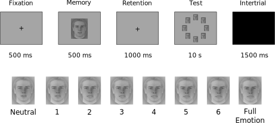

---
# HEADER AND FOOTER
main_topsize: 0.1 #percent coverage of the poster
main_bottomsize: 0.07

# BASICS
poster_height: "39.4in"
poster_width: "27.8in"
font_family: "Roboto"

# MAIN COLUR SCHEME
primary_colour: "#9B0014"
secondary_colour: "#9B0014"
accent_colour: "black"

# MAIN SECTION

main_fontfamily: "Roboto"
main_textcol: "#ffffff"
main_textsize: "125px"
logoleft_name: "img/r_logos.png"
logoright_name: "img/logo_affiliation.svg"
logocenter_name: "img/qr_code.svg"

# BODY SECTION
body_bgcol:
body_textsize: "39px"
body_textcol:
title_textsize: "100px"
author_textsize: "50px"
authorextra_textsize:
affiliation_textsize:
affiliation_textcol:
caption_textsize:
reference_textsize:

#ESSENTIALS
title: '**Visual Working Memory Precision for Emotional Faces in Moebius Patients**'
author:
  - name: '**Filippo Gambarota**'
    affil: 1
    main: true
    orcid: '0000-0002-6666-1747'
    twitter: fgambarota 
    email: filippo.gambarota@phd.unipd.it
  - name: Massimiliano Pastore
    affil: 1
    main: false
    email: 'ag.con@posterdown.net'
  - name: Roy Luria
    affil: 3
  - name: Pier Francesco Ferrari
    affil: 4
  - name: Paola Sessa
    affil: 1,2
affiliation:
  - num: 1
    address: Department of Developmental Psychology and Socialization, University of Padova, Italy
  - num: 2
    address: Padova Neuroscience Center, Padua, Italy
  - num: 3
    address: The School of Psychological Sciences, Tel Aviv University, Israel
  - num: 4
    address: Ferrari
main_findings:
  - "Facial mimicry impairment impacts the quality of visual working memory representations"
output: 
  posterdown::posterdown_betterport:
    self_contained: false
    pandoc_args: --mathjax
    number_sections: false
link-citations: true
bibliography: bib/poster_bib.bib
csl: bib/apa.csl
---

```{r, include=FALSE, cache=FALSE}
# Packages

library(here)
library(lattice)
library(tidyverse)
library(BayesFactor)
library(kableExtra)
library(effects)
library(nlme)
library(ggeffects)

knitr::opts_chunk$set(echo = FALSE,
                      warning = FALSE,
                      tidy = FALSE,
                      message = FALSE,
                      fig.align = 'center',
                      out.width = "100%",
                      cache = TRUE)
options(knitr.table.format = "html")

# Files
moebius <- readRDS(here("data", "cleaned", "moebius_cleaned.rds"))
load(here("objects", "bf_fit_obj.rda"))
```

# Introduction

Moebius syndrome is a rare neurological condition (estimated incidence of 0.002%) that primarly affect facial muscles control and eye movements (VII and VI cranial nerves). Models of **Sensorimotor Simulation** remark the importance of **Facial Mimicry** (i.e. the subtle movements of facial muscles in response to other people facial expressions) in facial expression processing and emotion recognition [@Goldman2005; @Wood2016]. Facial mimicry manipulation seems to have an impact on facial expression recognition [@Wood2016a] (metti qualche altra citazione).

Literature about emotion processing and social functioning in Moebius patients is very sparse and mainly related to the verbal component (i.e. facial expressions labelling and rating) [@Bogart2010; @Calder2000]. The Wood and colleagues model [-@Wood2016] proposed a lower level impact of sensorimotor simulation and facial mimicry on emotional processing, where visual representation quality (i.e. the emotional face) can be modulated by the sensorimotor activity.

Visual representations have been widely studied in cognitive neuroscience literature especially related to visual working memory activity (VWM). VWM can be defined as a limited-space cognitive system where visual information is temporarily stored and manipulated for further processing [@Liesefeld2019; @Zhang2008a].

VWM seems to be important in social cognition [Gambarota2019] and facial mimicry manipulation seems to change the precision of emotional face representations [@Sessa2018]. In this study we investigate if a congenital impairment in facial mimicry can impact the quality of visual working memory representations.

# Methods

We used a **Delayed Estimation Task** Figure \@ref(fig:paradigm). with emotional pictures (8 pictures) extracted from a facial expression video. Images ranged from neutral (0) to full facial expression (7) of **Anger**, **Fear** and **Happiness**. Subjects have to compare a brefly presented face (Memory Array) with a continous array made by the entire pool of images of the same emotion (Test Display). Our dependant variable (**Test-Memory**):

$abs(Pressed\;Level - Memory\;Level)$

Where:

* 0 = Correct
* 1-7 = Increasing Error

```{r paradigm, fig.cap="Delayed Estimation Task with Faces"}

```

### Sample

We collected **7 Moebius patients** (3 females, mean age of 34 years, SD=10.5) and **30 healthy volunteers** (15 females, mean age of 24.2, SD=4.6).

# Analysis

We use a `Linear Mixed-Effect Model` for modeling the absolute error distribution (Figure \@ref(fig:histgroup)) in the task as a function of **Emotion**, **Memory Level** and **Group**.
We use a *model selection* approach to select the best predictors combination to explain our data. For dealing with difference in variability we include in the model that `Moebius` and `Controls` have difference in variance.

```{r histgroup, fig.cap="Test - Memory Distribution"}
ggplot(moebius) +
    geom_histogram(data = moebius, aes(x = Test_Memory_Abs, y = ..density.. * .5, fill = Group), binwidth = 0.5) +
    coord_cartesian(xlim = c(0,7), ylim = c(0,.5)) +
    scale_x_continuous(breaks=seq(0,7,1)) +
    xlab("Test - Memory") +
    facet_wrap(.~Group) +
    ylab("Density") +
    theme(axis.title.x = element_text(size = 15),
          axis.title.y = element_text(size = 15),
          axis.text.x = element_text(size = 15),
          axis.text.y = element_text(size = 10),
          strip.text = element_text(size = 15),
          plot.title = element_text(hjust = 0.5, size = 20),
          legend.position = "none") +
    theme(panel.border = element_blank(),
          panel.grid.major = element_blank(),
          panel.grid.minor = element_blank())
```

<br/>
<br/>
<br/>
<br/>

# Results

We select the best factor combinations according to **Akaike Information Criteria (AIC)**, **Bayesian Information Criteria (BIC)** and **Bayes Factor (BF)**. The most important factors are **Emotion** and **Group**:

```{r, echo=TRUE, results="hide", size="tiny", include=FALSE}
lme(Test_Memory_Abs ~ Group + Emotion,
                random = ~1|Subject,
                weights=varIdent(form=~1|Group*Emotion),
                data = moebius,
                method = "REML")
```

```{r}
plot(bf_fit_include, main = "Predictors added to null model")
```

Our model:

$$Test-Memory = Group + Emotion$$

```{r, include=FALSE}
fit <- lme(Test_Memory_Abs ~ Group + Emotion,
           random = ~1|Subject,
           weights=varIdent(form=~1|Group*Emotion),
           data = moebius,
           method = "REML")

```

```{r fiteffects, out.width="100%", fig.cap="Model Effects for Group and Emotion"}
fit_eff <- as.data.frame(ggeffect(fit, terms = c("Group", "Emotion")))

ggplot(fit_eff) +
    geom_errorbar(aes(x = group, ymin = conf.low, ymax = conf.high),
                  width = .2,
                  size = .7) +
    geom_line(aes(x = group, y = predicted, color = x, group = x),
              size =.8) +
    geom_point(aes(x = group, y = predicted, color = x),
               size = 2) +
  theme(panel.border = element_blank(),
          panel.grid.major = element_blank(),
          panel.grid.minor = element_blank())
```

# References

<style>
#main-img-left {
 width: 20%;
}

#main-img-right {
 width: 20%;
}

#main-img-center {
 width: 6%;
}
</style>