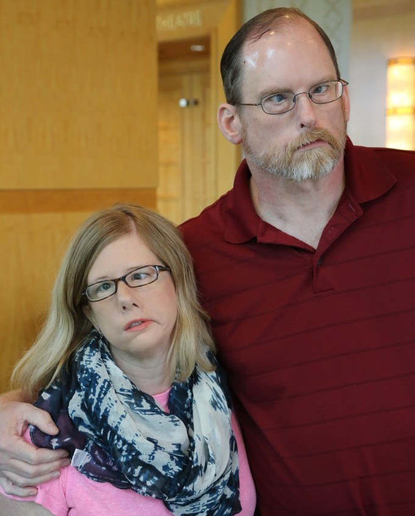
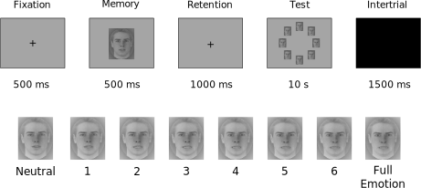

---
# HEADER AND FOOTER
main_topsize: 0.1 #percent coverage of the poster
main_bottomsize: 0.06

# BASICS
poster_height: "39.4in"
poster_width: "27.8in"
font_family: "Roboto"

# MAIN COLUR SCHEME
primary_colour: "#9B0014"
secondary_colour: "#9B0014"
accent_colour: "black"

# MAIN SECTION

main_fontfamily: "Roboto"
main_textcol: "#ffffff"
main_textsize: "125px"
logoleft_name: "img/r_logos.svg"
logoright_name: "img/logo_affiliation.svg"
logocenter_name: "img/qr_code.svg"

# BODY SECTION
body_bgcol:
body_textsize: "37px"
body_textcol:
title_textsize: "95px"
author_textsize: "50px"
authorextra_textsize:
affiliation_textsize:
affiliation_textcol:
caption_textsize:
reference_textsize: "12px"

#ESSENTIALS
title: '**Visual Working Memory Precision for Emotional Faces in Moebius Patients**'
author:
  - name: '**Filippo Gambarota**'
    affil: 1
    main: true
    orcid: '0000-0002-6666-1747'
    twitter: fgambarota 
    email: filippo.gambarota@phd.unipd.it
  - name: Massimiliano Pastore
    affil: 1
    main: false
  - name: Roy Luria
    affil: 2,3
  - name: Pier Francesco Ferrari
    affil: 4
  - name: Paola Sessa
    affil: 1,5
affiliation:
  - num: 1
    address: Department of Developmental Psychology and Socialization, University of Padova, Italy
  - num: 2
    address: School of Psychological Sciences, Tel Aviv University, Israel
  - num: 3
    address: Sagol School of Neuroscience, Tel-Aviv University, Ramat Aviv, Tel Aviv, Israel
  - num: 4
    address: Institut des Sciences Cognitives Marc Jeannerod UMR 5229, CNRS, and Université Claude Bernarde Lyon, Bron Cedex, France
  - num: 5
    address: Padova Neuroscience Center, Padova, Italy
main_findings:
  - "**Facial mimicry impairment impacts the precision of visual working memory representations**"
output: 
  posterdown::posterdown_betterport:
    self_contained: false
    pandoc_args: --mathjax
    number_sections: false
link-citations: true
bibliography: bib/poster_bib.bib
csl: bib/ieee.csl
---

```{r, include=FALSE, cache=FALSE}
# Packages

library(here)
library(lattice)
library(tidyverse)
library(BayesFactor)
library(kableExtra)
library(effects)
library(nlme)
library(ggeffects)

knitr::opts_chunk$set(echo = FALSE,
                      warning = FALSE,
                      tidy = FALSE,
                      message = FALSE,
                      fig.align = 'center',
                      out.width = "100%",
                      cache = TRUE,
                      fig.retina = 2)
options(knitr.table.format = "html")

# Files

moebius <- readRDS(here("data", "cleaned", "moebius_cleaned.rds"))
load(here("objects", "index_fit_memory.rda"))
source(here("functions", "ic_weights.R"))
```

# Introduction

**Moebius syndrome** is a rare neurological condition that primarily affects *facial muscles control and eye movements* (VII and VI cranial nerves). Models of **Sensorimotor Simulation** remark the importance of **Facial Mimicry** (i.e. the subtle movements of facial muscles in response to other people facial expressions) in facial expression processing and emotion recognition [@Goldman2005; @Sato2013; @Wood2016]. **Facial mimicry compromission** seems to have an impact on facial expression recognition [@Korb2016; @Oberman2007; @Wood2016a].

```{r, out.width="40%", fig.cap="People with Moebius Syndrome"}

```


Literature on **emotion processing and social functioning in Moebius patients** is very sparse and mainly related to the verbal component (i.e. facial expressions labelling and rating) [@Bogart2010; @Calder2000]. The model by Wood and colleagues [-@Wood2016] proposed an impact of sensorimotor simulation and facial mimicry at a low level of emotional processing such that the quality of visual representations can be modulated by the sensorimotor activity.

Visual representations have been widely studied in cognitive neuroscience literature especially related to visual working memory activity (VWM). VWM can be defined as a limited-space cognitive system where visual information is temporarily stored and manipulated for further processing [@Liesefeld2019; @Luck2008].

VWM seems to be important in social cognition [@Gambarota2019] and facial mimicry manipulations can modulate the precision of emotional face representations [@Sessa2018]. In this study we investigate if a congenital impairment in facial mimicry can impact the **precision** of VWM representations.

# Methods

We used a **Delayed Estimation Task** [@Zhang2008] (Figure \@ref(fig:paradigm)). with emotional pictures (8 pictures) extracted from a facial expression video. Images ranged from neutral (0) to full facial expression (7) of **Anger**, **Fear** and **Happiness**. Subjects had to compare a briefly presented face (Memory Array) with a continous array presenting the entire pool of images of the same emotion (Test Display). Our dependant variable (**Test-Memory**):

$abs(Pressed\;Level - Memory\;Level)$

Where:

* 0 = Correct
* 1-7 = Increasing Error

```{r paradigm, fig.cap="Delayed Estimation Task with Faces"}

```

#### Hypothesis

<font color="#0066ff"> <strong>The main hypothesis is that Moebius patients have lower visual working memory precision (in terms of higher mean error and higher variability) compared to the control group</strong></font>

**Sample**:

We collected **7 Moebius patients** (3 females, mean age of 34 years, SD=10.5) and **30 healthy volunteers** (15 females, mean age of 24.2, SD=4.6).

# Analysis

We used a `Linear Mixed-Effect Model` to model the absolute error distribution (Figure \@ref(fig:histgroup)) in the task as a function of **Emotion** (Fear, Happiness and Anger), **Group** (Moebius and Controls) and **Memory Level** (0-7) as a covariate. 
We use a *model selection* approach to select the best predictors combination (according to **Akaike Information Criterion** and **Bayesian Information Criterion**) to explain our data. In order to deal with difference in variability between groups we include in the model the possibility to have *heterogeneity of variances* among **Emotion** and **Group** factors.

```{r histgroup, fig.cap="Test - Memory Distribution"}
ggplot(moebius) +
    geom_histogram(data = moebius, aes(x = Test_Memory_Abs, y = ..density.. * .5, fill = Group), binwidth = 0.5) +
    coord_cartesian(xlim = c(0,7), ylim = c(0,.5)) +
    scale_x_continuous(breaks=seq(0,7,1)) +
    xlab("Test - Memory") + 
    facet_wrap(.~Group) +
    ylab("Density") +
    theme(axis.title.x = element_text(size = 20),
          axis.title.y = element_text(size = 20),
          axis.text.x = element_text(size = 15),
          axis.text.y = element_text(size = 10),
          strip.text = element_text(size = 15),
          plot.title = element_text(hjust = 0.5, size = 20),
          legend.position = "none") +
    theme(panel.border = element_blank(),
          panel.grid.major = element_blank(),
          panel.grid.minor = element_blank())
```

# Results

```{r}
mod <- names(all_models)
aic <- map_dbl(all_models, AIC)
bic <- map_dbl(all_models, BIC)

AIC_W <- weight.IC(aic)$w
BIC_W <- weight.IC(bic)$w

mod_avg <- data.frame(mod, AIC_W, BIC_W)

mod_avg <- mod_avg %>%
    pivot_longer(cols = c(AIC_W, BIC_W), names_to = "IC", values_to = "weight") %>%
    as.data.frame()
```

```{r fig.cap="Model Weights according to AIC and BIC. Only models with weight > 0.01 are plotted"}
mod_labels <- as.character(1:5)

ggplot(mod_avg %>% filter(weight > .05)) +
    geom_histogram(aes(x = mod, y = weight), stat = "identity", fill = "cornflowerblue") +
    facet_wrap(.~IC, ncol = 1) +
    coord_cartesian(ylim = c(0,.8)) +
    xlab("Models") +
    ylab("Weight") +
    scale_x_discrete(labels = mod_labels) +
    theme(axis.title.x = element_text(size = 20),
          axis.title.y = element_text(size = 20),
          axis.text.x = element_text(size = 15),
          axis.text.y = element_text(size = 12),
          strip.text = element_text(size = 15),
          plot.title = element_text(hjust = 0.5, size = 20),
          legend.position = "none") +
    theme(panel.border = element_blank(),
          panel.grid.major = element_blank(),
          panel.grid.minor = element_blank())
```

Where the best models are:

**Model 1**: AIC and BIC

<font color="#9B0014"> <strong>Test-Memory = Emotion + Group + Memory + Emotion x Memory</strong></font>

**Model 3**: BIC

Test-Memory = Emotion + Group

### Final Model

We selected the **Model 1**:

```{r}
fit_best <- lme(Test_Memory_Abs ~ Emotion + Group + Memory + Emotion:Memory,
           random = ~1|Subject,
           weights=varIdent(form=~1|Group*Emotion),
           data = moebius,
           method = "REML")

# graphical parameters

trellis.par.set(list(
  par.axis.text = list(cex = 2),
  par.ylab.text = list(cex = 1.5),
  par.xlab.text = list(cex = 1.5),
  par.main.text = list(cex = 1.5)))

# plots

plot(allEffects(fit_best)$Group, ylab = "Test - Memory")
plot(allEffects(fit_best)$`Emotion:Memory`, ylab = "Test - Memory")
```

# References

<style>
#main-img-left {
 width: 17%;
}

#main-img-right {
 width: 19%;
}

#main-img-center {
 width: 6%;
}
</style>